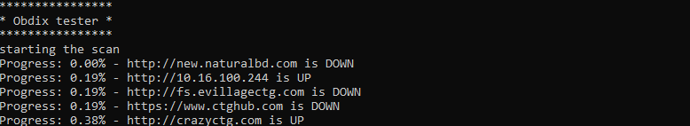

# bdix server checker

**Description** 
This is a bdix server checker tool designed for testing all the bdix server available in your network specially for bangladesh isp . 

Usage : 

open a terminal or cmd and write 

you need to have python to be installed in your system 

windows : 

`pip install - r requirements.txt`

`python [main.py](http://main.py)` 

linux : 

`chmod 777 [main.sh](http://main.sh) && ./main.sh`

done . 

Changing serverlist : : for changing server list paste your urls in at the end of url file 

feel free to enhance this repo . 

 for any quary :

Follow me on instagram :  https://www.instagram.com/obaidullahrion/